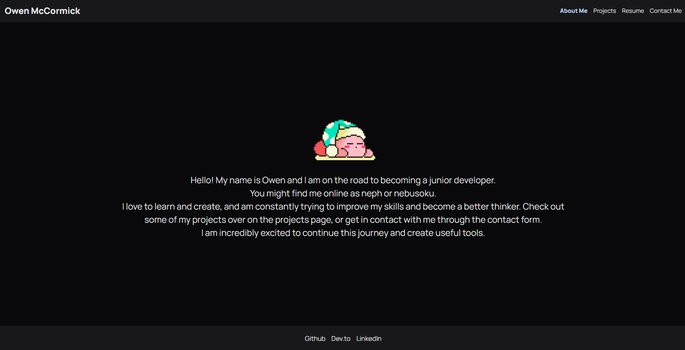

# Portfolio (Module 20 Challenge)

A simple portfolio showcasing some projects, along with a few other sections. Created with react and tailwind.

## Table of Contents

- [Screenshot](#screenshot)
- [Live Site](#live-site)
- [Installation](#installation)
- [Usage](#usage)
- [License](#license)

## Screenshot



## Live Site

Check out the live version of my portfolio [here](https://grand-paprenjak-a63561.netlify.app/).

## Installation

To install and run this project locally, follow these steps:

1. Clone the repository.
2. Navigate to the project directory.
3. Install the dependencies.
4. Start the development server:

   ```
    npm install
    npm run dev
   ```

## Usage

To use this project, follow these steps:

1. Open the live site [here](https://www.example.com).
2. Explore the different sections of the portfolio.
3. Click on the projects to learn more about them.
4. Contact me for any inquiries or collaborations.


## License

This project is licensed under the [MIT License](LICENSE).
